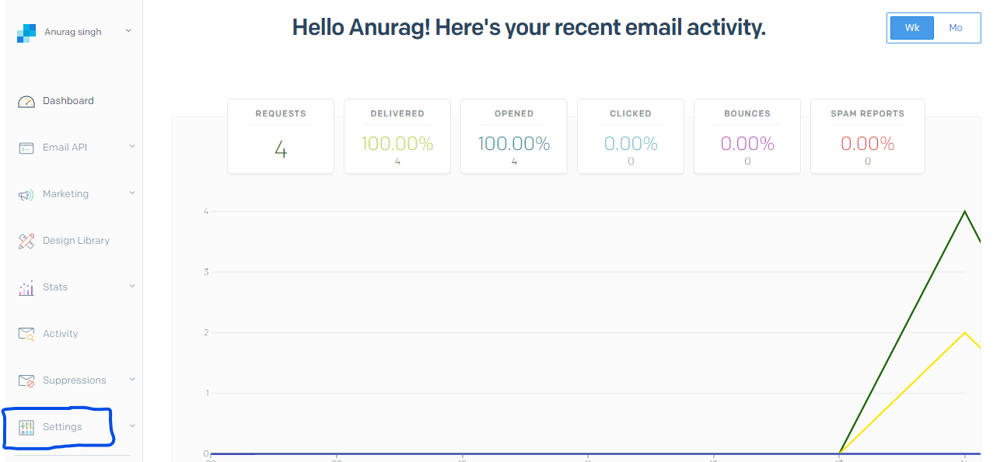
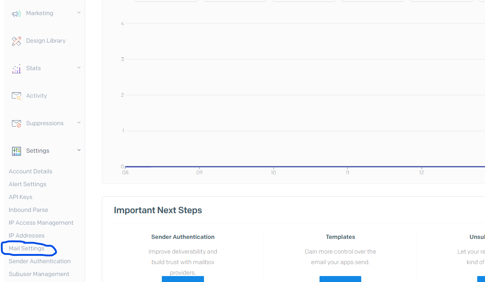
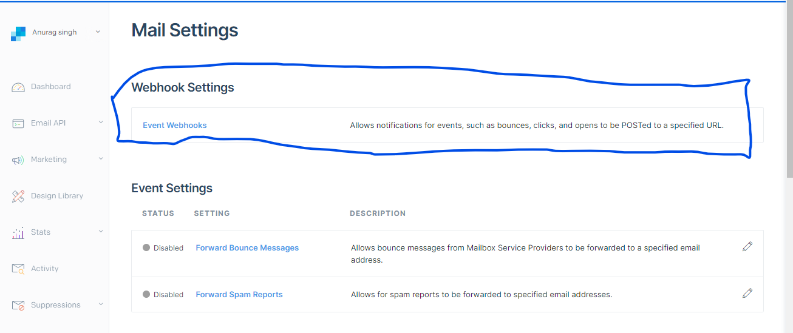
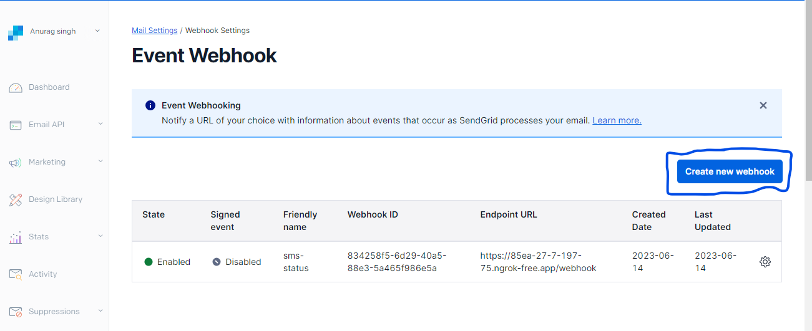
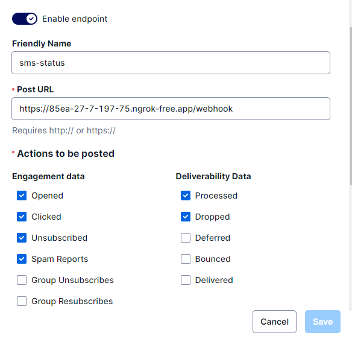

## To configure SendGrid webhook to receive status callbacks, follow these steps:

```
 Create a webhook endpoint: Set up a server or an endpoint on your server to receive the webhook callbacks from SendGrid. Make sure the endpoint is publicly accessible and can handle incoming HTTP requests.
```
## Configure the webhook settings in SendGrid:
```
1> Log in to your SendGrid account.
```
```
2> Go to the SendGrid dashboard.
```
```
3> Click on "Settings" in the left sidebar.
```

```
4> Select "Mail Settings" from the dropdown menu.
```

```
5> Go to webhook stting's there is event webhooks.
```

```
6> Now create new webhook
```

```
7> In the "HTTP POST URL" field, enter the URL of your webhook endpoint.
```
```
8>Choose the types of events you want to receive notifications for (e.g., delivered, opened, clicked, bounced, etc.).
```
```
9> Click the "Save" button to apply the changes.
```


## NOTE:-
```
Handle incoming webhook events: Implement the logic on your server to handle incoming webhook events from SendGrid. Parse the JSON payload sent by SendGrid and extract the relevant information such as event type, recipient, message ID, etc. You can use the previously provided code snippet as a starting point and modify it according to your requirements.

Verify event authenticity: To ensure the authenticity of the webhook events, SendGrid provides a signature header (X-Twilio-Email-Event-Webhook-Signature) that you can validate. Implement the verification logic using the provided signature to ensure that the events are indeed sent by SendGrid.

Process the webhook events: Once you receive the webhook events and validate their authenticity, you can process them according to your application's needs. For example, you can update your internal database with the delivery status, send notifications, or perform other actions based on the event type.

By following these steps, you will be able to configure SendGrid to send webhook callbacks to your specified endpoint, allowing you to receive and process status updates for your sent emails.
```

